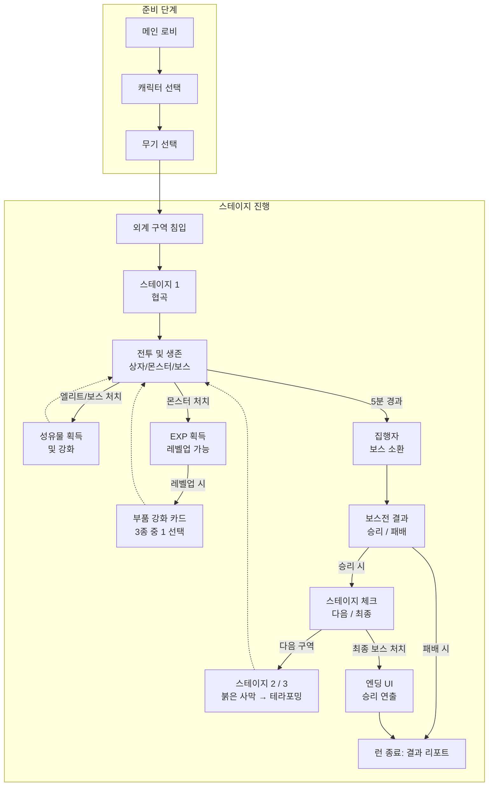

# Xenoforce

내일배움캠프 Unreal 트랙 8기 · Team 2 · CH3 팀 프로젝트

| 항목 | 내용 |
| --- | --- |
| 게임 명 | **Xenoforce** |
| 장르 | 로그라이크 · FPS |
| 컨셉 | SF |
| 플랫폼 | PC |

폐기장에서 거두어진 구형 휴머노이드가 멈춰가는 태엽 심장을 버티기 위해 외계인 구역에 잠입하는 **뱀파이어 서바이벌류 FPS**입니다. 적을 섬멸하며 얻은 부품과 성유물로 한 판(Run) 동안 폭발적으로 성장하고, 마지막 스테이지 보스를 처치해 외계 코어를 획득하는 것이 목표입니다.

---

## 🎮 다운로드 & 플레이

[Xenoforce 게임 다운로드 클릭](https://github.com/NBcampUnrealTrack/8th-Team2-CH3-Project/releases/latest)

1. [Releases](.../releases/latest)에서 zip 다운로드 후 압축 해제
2. `XENOFORCE.exe` 실행

---

## 시연 영상
아래 이미지를 클릭하시면 Youtube로 연결됩니다.

---

## 📚 기획 문서

아래 세 문서를 각각 펼쳐서 확인할 수 있습니다.

<b>📘 기획서</b> — 게임 전체 기획 (콘셉트 · 시스템 · 캐릭터 · 보스 · 스테이지 · 세계관)

 

### 1. 핵심 콘셉트

**한 줄 로그라인**
> 외계 문명에 점령된 지구에서, 강해지기 위해 외계 구역에 잠입한 휴머노이드를 조종하는 SF 로그라이크 FPS.

**3 Key Pillars**
- **수집을 통한 진화** — 부품과 성유물을 모아 캐릭터를 한계까지 강화
- **폭발적인 화력의 카타르시스** — 고화력 원거리 사격으로 적을 쓸어담는 쾌감
- **시각적 불협화음** — 자연과 기계, 스팀펑크와 SF의 기괴한 대비

### 2. 핵심 루프 (런 내부)

| 단계 | 내용 |
| --- | --- |
| 진입 | 초기 무기 세팅 및 외계 구역 침입 |
| 전투 & EXP 획득 | 적 처치로 EXP·성유물 획득 |
| 실시간 성장 | 레벨업 시 부품 강화 카드 4종 중 1 선택 |
| 스킬 활용 | 게이지(쿨타임) 충전 시 스킬 사용 |
| 집행자 조우 | 스테이지 시작 3분 후 보스 소환 |
| 보상 | 보스 처치 시 일시정지 → 성유물 팝업에서 선택 |
| 런 종료 | 마지막 스테이지 보스 처치 또는 사망 시 결과 리포트 |

> ⚠️ 게임 시작 시 캐릭터와 무기를 먼저 선택하며, 런이 끝날 때까지 변경할 수 없습니다.

### 3. 전투 시스템

고화력 원거리 사격을 핵심 재미로 하는 사격 중심 전투입니다.

| 구분 | 타입 | 특징 |
| --- | --- | --- |
| Main | 원거리 사격 | 기본 공격, 높은 화력 (총기별 데미지·RPM·탄창 데이터) |

- **중앙 조준**: 카메라 중앙 조준 시스템 기반

### 4. 성장 시스템 (런 내부)

런 내부 성장은 판이 끝나거나 사망하면 초기화되는 휘발성 성장입니다.

| 구분 | 설명 |
| --- | --- |
| 레벨업 | 적 처치로 EXP 획득, 레벨업마다 부품 강화 카드 4종 중 1 선택 |
| 부품 4종 | 총알 · 탄창 · 스코프 · 손잡이 (각 최대 4레벨) |
| 만렙 | 캐릭터 16레벨 = 부품 전체 4레벨 (총 16회 성장으로 풀강 설계) |
| 성유물 | 엘리트·보스 처치 시 일시정지 팝업에서 특수 능력 선택 |

### 5. 캐릭터 & 스킬

캐릭터당 고유 액티브 스킬 1종, 쿨타임 기반 작동.

| 캐릭터 | 스킬 | 효과 | 역할 |
| --- | --- | --- | --- |
| A | 시공간 과부하 | (플레이어 제외) 주변 시간 감속 | 유틸리티 / 환경 제어 |
| B | 오버드라이브 | 5초간 이동·재장전 속도 50% 증가 | 공격적 버프 / 화력 지속 |
| C | 이온 폭발 | 주변 넉백 + 피해 | 방어적 광역기 / 위기 탈출 |

### 6. 무기

- **권총** — 밸런스형 (단발 위력·정확도 높음)
- **AR** — 연사 기동형 (빠른 발사 속도)
- **펌프 액션 샷건** — 근접 화력형 (짧은 사거리·범위 특화)

부품 강화(최대 4레벨): 총알(데미지) · 탄창(장전 속도) · 스코프(정확도) · 손잡이(반동 감소).

### 7. 몬스터 & 보스

- **FSM**: `Chase` → `Run` → `Attack` → `Hit` → `Death`
- **스폰**: 캐릭터 주변 최소/최대 거리 기반 랜덤 스폰 (Object Pool로 최적화)
- **소환**: 엘리트 확률 랜덤 소환 / 보스 스테이지 시작 3분 후
- 몬스터가 많을수록 자원 획득 효율이 커지는 몰이사냥 구조
- **보스 보상**: 처치 시 일반 상자보다 높은 등급·희귀 옵션의 성유물 확정 지급

**보스 공격 패턴** (개발 기간을 고려해 모든 스테이지 보스 공통 구현)

| 패턴 | 공격 방식 | 대응 |
| --- | --- | --- |
| 파워 슬램 | 손을 들어 정면 바닥 내려찍기 | 옆으로/점프 회피 (공통) |
| 플라즈마 구체 | 거대 에너지 구체 생성·발사 | 사격으로 파괴 또는 무빙 회피, [A:시간지연]으로 파괴 용이 |

### 8. 스테이지

총 3개 구역. 보스를 처치하면 다음 구역이 열리고, 스테이지 3 보스를 처치하면 외계 코어를 획득하며 엔딩.

| 순서 | 스테이지 | 진입 조건 | 맵 크기 |
| --- | --- | --- | --- |
| 1 | 협곡 (The Canyon) | 기본 제공 | 505×505 |
| 2 | 붉은 사막 (The Crimson Wasteland) | 스테이지 1 보스 처치 | 505×505 |
| 3 | 테라포밍 (The Glitched Bio-Zone) | 스테이지 2 보스 처치 | 505×505 |

- **협곡** — 좁고 깊은 골짜기·절벽의 험난한 지형. 좁은 길목 교전.
- **붉은 사막** — 붉은 모래의 광활한 실외 맵. 안개 속 긴장감 있는 교전.
- **테라포밍** — 초원 들판에 기계가 섞인 부조화. 넓은 시야로 적 위치 파악 용이.

### 9. 세계관 & 아트 컨셉

외계 문명의 식민지가 된 지구. 폐기장에서 가난한 기계 과학자 '영감'에게 거두어진 구형 휴머노이드가, 멈춰가는 태엽 심장을 버티기 위해 외계인의 삼엄한 구역에 잠입해 최첨단 부품을 훔치는 이야기.

- **주인공**: 사람 형태에 기계가 섞인 **스팀펑크** 느낌
- **외계인**: 매끄럽고 푸른 네온 빛의 **SF** 느낌
- **분위기**: 절박하지만 경쾌한. 긴박한 신스웨이브 + 아케이드풍 효과음

### 10. 엔딩 & 결과 시스템

- **결과 리포트**: 플레이 시간, 킬 수, 최종 빌드 요약
- **성공/실패 연출**: 수명 연장 성공 여부에 따른 시각 연출
- **목적**: 성취감 제공 + 빌드 기록으로 반복 플레이 유도

<b>📊 데이터베이스</b> — 밸런스 수치 시트 (캐릭터 · 무기 · 몬스터 · EXP · 부품 · 세이브)

 

> `int32` 기준 모든 소수점은 반올림 계산. 모든 수치는 Unreal Engine의 `DataTable` / `DataAsset` 구조에 최적화.

### 1. 캐릭터 기본 스탯 (Lv.1 ~ 16)

| 구분 | 변수명 | 자료형 | Lv.1 | 레벨당 증가 | Lv.16 | 비고 |
| --- | --- | --- | --- | --- | --- | --- |
| 최대 체력 | `MaxHP` | int32 | 100 | +16 | 340 | 탱커형 200 권장 |
| 이동 속도 | `MoveSpeed` | float | 1000.0 | +18.0 | 1288.0 | 항상 달리기 |
| 점프 높이 | `JumpZVelocity` | float | 420.0 | - | - | 최대 수직 고도 결정 |
| 스킬 활성 시간 | `ActiveSkillTime` | float | 기본 5.0 | - | - | 스킬마다 상이 |
| 스킬 쿨타임 | `SkillCooldown` | float | 기본 20.0 | - | - | 스킬마다 상이 |
| 자석 범위 | `MagnetRadius` | float | 1000.0 (10m) | - | - | 성유물로 업그레이드 |
| 레벨 | `Level` | int32 | 1 | +1 | 16 | |

### 2. 무기별 기본 스탯 (Lv.1)

| 항목 | 변수명 | 권총 | AR | 샷건 |
| --- | --- | --- | --- | --- |
| 데미지 | `AmmoDamage` | 25 | 15 | 8×8 |
| RPM | `RoundsPerSecond` | - | 5 | - |
| 장전 속도 | `ReloadTime` | 1.2s | 2.0s | 3.5s |
| 사거리 | `EffectiveRange` | 40m | 40m | 8m |
| 탄창 | `MaxAmmo` | 12 | 30 | 5 |
| 크리티컬 배율 | `CritMultiplier` | 2.0x | 1.5x | 1.2x |
| 반동 | `Recoil` (FVector2D) | (3.0, ±0.2) | (1.5, ±0.5) | (12.0, ±2.0) |
| 집탄률 | `SpreadAngleDegrees` | 3.0 | 5.0 | 12.0 |

### 3. 몬스터 스탯 (Stage 1)

| 항목 | 변수명 | 일반(근접) | 일반(원거리) | 엘리트(근접) | 엘리트(원거리) | 보스 |
| --- | --- | --- | --- | --- | --- | --- |
| 체력 | `MaxHP` | 60 | 45 | 600 | 450 | 5000 |
| 데미지 | `AttackDamage` | 5 | 4 | 15 | 12 | 50 |
| 이동 속도 | `MovementSpeed` | 350 | 280 | 400 | 320 | 250 |
| 공격 속도 | `AttackRate` | 1.5s | 2.5s | 1.0s | 1.8s | 2.5s |
| 공격 사거리 | `AttackRange` | 150 | 800 | 200 | 900 | 1000 |
| 등급 | `MonsterGrade` | 1 | 1 | 2 | 2 | 3 |

### 4. EXP & 레벨업 테이블

- **최대 레벨**: 16 (만렙 도달 시 이후 톱니바퀴로 환산)
- **요구량 공식**: `Next_EXP = 200 * (1.35 ^ Current_Level)`
  - Lv.1 → 2: 200 EXP (일반 몹 약 20마리)
  - Lv.8 → 9: 약 1,600 EXP
  - Lv.15 → 16: 약 12,200 EXP
- **EXP 등급**: 등급1(10) · 등급2(100) · 등급3(1000)

### 5. 부품 강화 (최대 4레벨, 레벨당 누적)

| 부품 | 주요 스탯 | 레벨당 | 변수 |
| --- | --- | --- | --- |
| 총알 | 데미지 | +25% | Bullet |
| 탄창 | 장전 속도 | −15% | Magazine |
| 스코프 | 정확도 | −20% | Scope |
| 손잡이 | 반동 감소 | −20% | Handle |

### 6. SaveSystem 변수

| 구분 | 변수명 | 자료형 | 기본값 |
| --- | --- | --- | --- |
| 데이터 버전 | `SaveVersion` | int32 | 3 |
| 보유 유물 | `RelicIDs` | TArray\<int32\> | - |
| 플레이어 레벨 | `PlayerLevel` | int32 | 0 |
| 선택 스킬 | `PlayerSkill` | int32 | 0 |
| 선택 무기 | `PlayerWeapon` | int32 | 0 |
| 그립 강화 레벨 | `GripLevel` | int32 | 0 |
| 스코프 강화 레벨 | `ScopeLevel` | int32 | 0 |
| 탄창 강화 레벨 | `MagazineLevel` | int32 | 0 |
| 탄환 강화 레벨 | `BulletLevel` | int32 | 0 |
| 스테이지 클리어 기록 | `StageClearTime` | TArray\<float\> | {0.f, 0.f, 0.f} |
| 처치 수 | `MeleeKills` / `RangedKills` `EliteMeleeKills` / `EliteRangedKills` `BossKills` | int32 | 0 |
| 누적 데미지 | `TotalDamage` | int32 | 0 |

### 7. 성유물 목록

| 등급 | 이름 | 부위 | 능력 | 아이템 ID |
| --- | --- | --- | --- | --- |
| 일반 | 생명의 파동 목걸이 | 생명력 | 최대 생명력 15 증가 | 1000 |
| 일반 | 적색 별조각 팔찌 | 공격력 | 공격력 5 증가 | 1002 |
| 일반 | 낡은 별자리 조준경 | 크리티컬 | 크리티컬 시 추가 피해 5% 증가 | 1003 |
| 일반 | 낡은 시간 가속기 | 쿨타임 | 스킬 쿨타임 5 증가 | 1004 |
| 일반 | 낡은 탐사 부츠 | 이동속도 | 이동속도 25 증가 | 1005 |
| 희귀 | 푸른빛 항성 팔찌 | 크리티컬 | 크리티컬 시 추가 피해 10% 증가 | 1006 |
| 희귀 | 두개골 관통 부적 | 공격력 | 공격력 10 증가 | 1007 |
| 희귀 | 생명의 공명 목걸이 | 생명력 | 최대 생명력 30 증가 | 1009 |
| 희귀 | 중력 완화 부츠 | 이동속도 | 이동속도 50 증가 | 1010 |
| 희귀 | 시간 압축 모듈 | 쿨타임 | 쿨타임 15 증가 | 1011 |
| 희귀 | 생태계 포션 | 생명력 | 10초마다 최대 6 회복 | 1027 |
| 유니크 | 은하 도항선 | 이동속도 | 이동속도 120 증가 | 1012 |
| 유니크 | 북두의 조준 부적 | 크리티컬 | 크리티컬 시 추가 피해 25% 증가 | 1013 |
| 유니크 | 성안의 반지 | 공격력 | 공격력 25 증가 | 1014 |
| 유니크 | - | 쿨타임 | 스킬 쿨타임 5 증가 | 1015 |
| 유니크 | 은하 거인의 심장 | 생명력 | 최대 생명력 100 | 1016 |
| 유니크 | 거부의 오로라 향로 | 생명력 | 주변 지속 피해 | 1117 |
| 유니크 | 별똥별 부적 | 특별 | 3초마다 무작위 위치 별똥별 소환 | 1118 |
| 유니크 | 핏빛 양날검 | 특별 | 최대 생명력 감소 공격력 50% 증가 | 1119 |
| 유니크 | 천체의 뇌전 거울 | 특별 | 5초마다 플레이어 주위 무작위 위치에 번개를 쳐 데미지 70 2번 발동 | 1120 |
| 레전드 | 순환하는 달의 서 | 특별 | 일정 시간마다 무작위 버프 | 1121 |
| 레전드 | 천칭의 심판 저울 | 특별 | 5초 마다 적 2명에게 심판 공격 | 1123 |
| 레전드 | 달토끼의 달가루 | 이동속도 | 주위에 달조각 생성 0.4 마다 10데미지 | 1124 |
| 레전드 | 장미 | 특별 | 보유한 유물 수에따라 스탯 증가 | 1122 |
| 레전드 | 일기장 | 특별 | 부활 | 1125 |

<b>🗺️ 게임 플로우 차트</b> — 메타 루프 / 런 루프 전체 흐름

 

### 주요 시스템 설명

**준비 단계** — 메인 로비에서 캐릭터 → 무기를 선택한 뒤 외계 구역에 침입.

**스테이지 진행 (런 루프)**
- **전투 및 생존**: 상자·몬스터·보스와 교전하는 메인 단계로, 세 갈래로 분기
  - **엘리트/보스 처치** → 성유물 획득 및 강화 후 전투로 복귀
  - **몬스터 처치** → EXP 획득, 레벨업 시 부품 강화 카드 중 1 선택 후 전투로 복귀
  - **5분 경과** → 집행자(보스) 소환
- **보스전 결과**: 승리 시 스테이지 체크, 패배 시 결과 리포트로 직행
- **스테이지 체크**: 다음 구역이 있으면 스테이지 2(붉은 사막) → 3(테라포밍)으로 진행, 최종 보스 처치 시 엔딩 UI

**스테이지 순서** — 협곡(1) → 붉은 사막(2) → 테라포밍(3)

**결과 & 정산** — 엔딩 또는 패배 시 결과 리포트로 런 종료.

---

## 기술 스택

- **Engine**: Unreal Engine 5
- **Language**: C++ (`int32`, `float`, `FVector2D` 등 UE 자료형 기반)
- **Data**: `DataTable` / `DataAsset` 로 밸런스 수치 일괄 관리
- **주요 시스템**: `LevelFlowSystem`(레벨 전환), `Battle System`(전투 계산·통계), `SaveSystem`(직렬화), Object Pool 스폰

---

## 팀 구성

| 이름 | 역할 |
| --- | --- |
| 신보원 | 플레이어, 스킬, 무기 |
| 김지원 | 서브 기획, PR 리뷰, 아트 메인, SaveSubSystem, LevelFlowSubSystem |
| 고예현 | 메인 기획, PR 리뷰, 아트 서브, BattleSubSystem, 힐 토템 |
| 양준우 | 서브 기획, 성유물 시스템 |
| 김대현 | 몬스터, 적 AI |
| 윤준학 | UI |
---

© 2026 Team 2, NBcamp Unreal Track 8th. CH3 Team Project — <i>Xenoforce</i>
